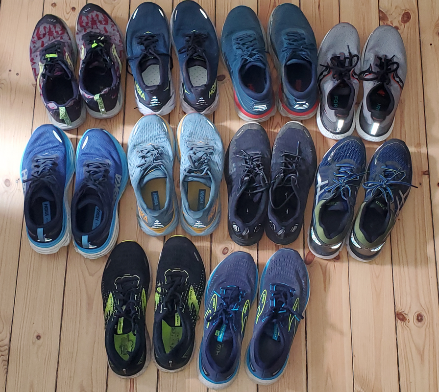

# Titles
- Running from a professed non-runner 
- Discovering the Runner Within: A Journey from A professed Non-Runner to a Distance runner 

## Sections
- [Hook](hook.md)
- [Personal History](personal_history.md)
- [Practical Steps to Getting Started](practical_steps_to_getting_started.md)
- [Establish A Ritual](establish_a_ritual.md)
- [Be Kind To Yourself](be_kind_to_yourself.md)
- [Hydration](hydration.md)
- [Injury](injury.md)
- [Gear](Gear.md)
- [The Virus That Spreads](the_virus.md)
- [The Perfect Distance](the_perfect_distance.md)
- [Your Brain On Running](your_brain_on_running.md)
